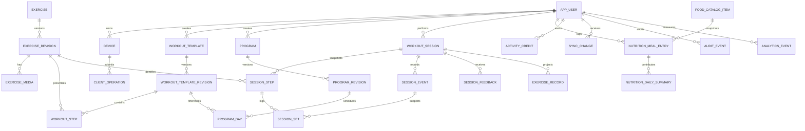

# FORMA: production-ready архитектура тренировок

**Автор:** Manus AI  
**Статус:** архитектурный отчёт и целевая схема данных  
**Основание:** локальная ревизия `simaklaw/forma` `318a3d6` и результаты четырёх сравнительных анализов.  
**Область:** тренировочный домен; nutrition рассматривается как смежный, но автономный bounded context.

## Резюме решения

FORMA уже имеет убедительный клиентский прототип: TypeScript-монорепозиторий с общим `@forma/core`, мобильным клиентом Expo/React Native и web-клиентом Vite/React. В нём есть локальные Zustand stores, журнал подходов, видео, haptic/audio-таймер отдыха, базовые nutrition-данные и тесты чистых вычислений. Однако текущая модель не является моделью тренировки как восстанавливаемой сессии: мобильный клиент считает подходы по дням, web-player хранит минимальный UI-session, а общий store сводит food и workout logs в один плоский state. Синхронизация, серверная идентичность, неизменяемая история, версии контента и идемпотентная доставка отсутствуют в доступной ревизии. [1]

Целевое решение — **offline-first событийный workout aggregate**. Сессия создаётся на устройстве из неизменяемого снимка версии тренировки, все пользовательские действия записываются локально транзакционно как упорядоченные события, а затем идемпотентно синхронизируются с PostgreSQL. Сервер хранит канонический журнал и проекции; клиентская SQLite-база обеспечивает старт, выполнение и возобновление без сети. `WorkoutSession` и её события — источник истины для player, истории, completion, прогресса и аналитики. Счётчики streak, рекорды, калории и экранные summary являются пересчитываемыми проекциями, а не единственным первоисточником.

> **Главное архитектурное правило:** прошлую тренировку нельзя изменить обновлением плана, упражнения, алгоритма или клиентского экрана. Она всегда воспроизводится из `session_snapshot`, ссылок на revision и append-only `session_event`.

Порядок реализации: сначала P0 закрывает устойчивый player, локальную базу, снимки контента, state machine и тесты; P1 добавляет серверную sync-петлю, feedback, аналитику и custom workouts; P2 — health-интеграции, сложную адаптацию, дыхательные практики и социальные возможности. Nutrition не должен становиться таблицами внутри workout-модуля: домены связываются только общей идентичностью и версионированными событиями/summary-контрактами.

---

## 1. Источники и граница достоверности

### 1.1. Как читать выводы

В отчёте используются две метки доказательности.

- **Факт** — утверждение, непосредственно наблюдаемое в локальной FORMA либо явно зафиксированное в результатах статического анализа конкурентного приложения. Для конкурентов это факт *о содержимом анализа или признаках в APK*, а не гарантия того, что функция доступна каждому пользователю, работает в последней версии или реализована именно так на сервере.
- **Реконструкция / решение** — инженерный вывод, который логически следует из наблюдений или является рекомендуемым проектом для FORMA. Он не приписывается конкуренту как установленный факт.

Такое разделение особенно важно, потому что материалы конкурентов основаны преимущественно на именах классов, строках, manifest, схемах и декомпиляции, а не на полном исходном коде и production-бэкендах. [2] [3] [4] [5]

### 1.2. Что дали четыре анализа

| Источник | Факты из предоставленного анализа | Архитектурное значение для FORMA | Ограничение интерпретации |
|---|---|---|---|
| Home Workout / Fitify | Анализ сопоставляет компактный flow «каталог → упражнение → результат → история» с более широкой оболочкой Fitify: планы, дни плана, preview, отдельный player, custom workouts, история, достижения и интеграции. [2] | Лучший ориентир для границы **plan / day / workout / session** и отдельного session engine. | Выводы о Fitify в материале частично являются product-реконструкцией, а не контрактом его backend API. |
| Home Workouts Pro | В анализе зафиксированы `WorkoutStructure`, `WorkoutRes`, `Preference`, локальная Room/SQLite-модель, история, streak, голосовые подсказки, музыка, напоминания и custom-workout flow. [3] | Подтверждает необходимость offline-first хранения, настройки сигналов и разделения шаблона тренировки от результата выполнения. | Точная схема таблиц и полный жизненный цикл не восстановлены из исходников. |
| Fitstars (`rus39`) | Зафиксированы сущности текущей тренировки, completion, дневной/недельной статистики, streak freeze, remote API/repository/domain/local layers, completion screen и календарь activity dots. [4] | Лучший ориентир для completion, удержания, календарной проекции и различения доменной истории сессии и мотивационных проекций. | Экономика stars и premium-механики не нужны для ядра player и не должны копироваться автоматически. |
| YAZIO Pro | Анализ выделяет дневник питания, воду, body values, streak, AI insights, локальное хранилище с backend sync и feature-модульную структуру `api / presenter / implementation / ui`. [5] | Обосновывает изолированный nutrition bounded context и контрактную интеграцию вместо смешивания еды и тренировок в одном store. | Это nutrition-референс, а не эталон workout-player. |

### 1.3. Рейтинг референсов для задачи тренировок

Это **рейтинг применимости**, а не рейтинг качества приложений в целом. Первая позиция означает наибольшую полезность для проектирования production workout-домена FORMA.

| Место | Референс | Почему | Что переносить | Что не переносить |
|---:|---|---|---|---|
| 1 | Fitify в сравнительном анализе | Наиболее полная целевая продуктовая форма: планы, дни, preview, player, история и custom workouts. [2] | Модель плана и отдельный player/session lifecycle. | Закрытые классы, идентификаторы, paywall-детали и чужой UI-код. |
| 2 | Home Workouts Pro | Самый прямой сигнал о локальной структуре тренировки, Room, media, voice и custom flow. [3] | Offline-first, разделение структуры и результата, voice/music preferences. | Рекламный стек и чрезмерно перегруженные экраны. |
| 3 | Fitstars | Самые сильные retention-паттерны: completion, activity calendar, streak freeze, профили статистики. [4] | Мягкий completion, честный streak, простые награды. | Dual-currency, покупаемые stars и сложные gift-потоки на старте. |
| 4 | YAZIO Pro | Самый полезный ориентир для границы nutrition, modularity и sync, но не для силового player. [5] | Изолированные feature boundaries, food logging как отдельный домен, daily summaries. | Прямое смешивание offers/магазина/рекламы с тренировочным циклом. |

---

## 2. Текущее состояние FORMA: факты и разрывы

### 2.1. Подтверждённый стек

**Факт.** Репозиторий — pnpm/Turborepo-монорепозиторий с требованием Node.js 22+ и пакетами `apps/mobile`, `apps/web`, `packages/core`. `@forma/core` написан на TypeScript и содержит engines, AI-сервисы, MET/калорийные функции и Zustand-state. [1]

**Факт.** Mobile — Expo SDK 51, React Native 0.74, React 18, React Navigation, Zustand 4, AsyncStorage, `expo-av`, `expo-haptics`, `@gorhom/bottom-sheet`; конфигурация использует идентичность `FitPulse`/`app.fitpulse.native`, тёмную тему и Android permission `VIBRATE`. [1]

**Факт.** Web — Vite, React 19, TanStack Router, Zustand 5, Tailwind, `@forma/core` и локальный video-player. [1]

**Факт.** В mobile есть `RestTimerEngine`, который вычисляет остаток отдыха от wall clock (`startedAt`, `durationMs`, `Date.now()`), подписывается на `AppState` и воспроизводит haptic/audio на завершении. Это более устойчиво к foreground/resume, чем счётчик, который просто декрементируется по `setInterval`. [1]

**Факт.** В mobile workout-plan задан прямо в `WorkoutScreen.tsx`; `useFitPulseStore` хранит `setLogs`, `dayProgress`, `personalRecords`, weight и food state в одном персистируемом JSON-объекте AsyncStorage. В web есть отдельный `Session` с `planId`, `exerciseIndex`, `setsDone`, `restEndsAt`, `startedAt`; web persist не сохраняет этот session в `partialize`. [1]

**Факт.** Имеются unit-тесты engines/stores и отдельный ручной QA checklist. Checklist прямо указывает, что реальное поведение таймера после блокировки, звук, haptics, TalkBack и увеличенный шрифт не были подтверждены на физическом устройстве в среде разработки. [1]

### 2.2. Карта «сейчас → целевое состояние»

| Область | Наблюдаемое сейчас | Риск или разрыв | Целевое решение |
|---|---|---|---|
| Источник истины | Дневные счётчики подходов в mobile; минимальная UI-session в web; общий core хранит плоские `foodLogs` и `workoutLogs`. [1] | Нельзя доказуемо восстановить ход одной тренировки, отличить skip от completion или корректно объединить устройства. | `workout_session` + append-only `session_event` + session snapshot; проекции отдельно. |
| Контент | Программы и упражнения частично hard-coded в экранах и web catalog. [1] | Изменение кода меняет смысл исторической тренировки. | Версионированные catalog/template/program revisions и неизменяемый snapshot при старте. |
| Локальное хранение | Zustand + AsyncStorage JSON. [1] | Нет транзакции «событие + проекция + outbox», индексов, частичной sync и конфликтной модели. | SQLite на устройстве, outbox/inbox, checkpoint и domain repositories. |
| Sync и identity | В доступных manifests/source нет backend, auth, server DB или sync-протокола. [1] | Данные привязаны к установке, экспорт — не multi-device sync, нет серверной идемпотентности. | Auth/user/device, PostgreSQL, push/pull cursor, idempotency keys и RLS. |
| Player | Есть set completion, rest и видео; web «Готово» завершает session независимо от полноты, а выход завершает её с `completed=false`. [1] | Семантика «выполнено», «пропущено», «прервано» смешана; ранний выход необратим. | Явная state machine, отдельные skip/leave события, resume вместо удаления. |
| Analytics/audit | В доступной ревизии нет общего event schema или аудиторского следа. [1] | Невозможно отладить спорный completion, дубликат sync или воронку player. | Раздельные session/audit/product-analytics события. |
| Nutrition | Food, water и metabolic profile лежат рядом с workout state. [1] | Любое развитие питания повышает связанность player и риск конфликтов. | Отдельная схема/модуль nutrition; связность только через user и versioned summary/event contract. |

### 2.3. Архитектурный вывод

**Реконструкция.** FORMA не нужно переписывать в другой клиентский фреймворк. Expo/React Native, TypeScript и общая библиотека уже подходят для целевого решения. Нужно заменить роль Zustand: он должен остаться лёгким presentation-state слоем, но перестать быть долговременным доменным хранилищем тренировки. Доменная state machine и репозитории должны быть platform-neutral внутри `@forma/core` или нового `@forma/workout-domain`; SQLite и HTTP — адаптеры мобильного/веб-клиентов.

До начала схемы следует принять одно продуктовое решение: **FORMA — имя продукта и домена, FitPulse — временное mobile branding или осознанный отдельный бренд.** В P0 надо унифицировать scheme, bundle/package ID, storage namespaces, аналитический app identifier и privacy-тексты. Иначе миграции данных и ключи idempotency будут обслуживать две идентичности приложения.

---

## 3. Целевая архитектура

### 3.1. Принципы

1. **Offline-first, не offline-only.** Пользователь может начать и закончить тренировку без сети. Синхронизация доставляет уже записанные операции и не определяет, можно ли нажать «начать».
2. **Сессия, а не экран, является aggregate root.** UI можно переоткрыть, обновить и заменить без изменения семантики тренировки.
3. **Контент неизменяем в истории.** `ExerciseRevision`, `WorkoutTemplateRevision`, `ProgramRevision` и JSON snapshot исключают «переопределение прошлого».
4. **События неизменяемы, проекции пересчитываемы.** `session_event` — доказуемая последовательность действий. Streak, PR, calories, charts и completion card — materialized/read projections.
5. **Одна команда — один устойчивый идентификатор.** Клиент генерирует UUIDv7 (или ULID); retry отправляет тот же `operation_id` и `event_id`, а не создаёт новую тренировку.
6. **Время хранится в UTC вместе с исходным локальным контекстом.** `timestamptz` отвечает на вопрос «когда», `local_date` и `timezone` — на вопрос «какой это был день для streak». Нельзя пересчитывать исторический streak по текущему timezone профиля.
7. **Nutrition — самостоятельный домен.** Workout не делает SQL join к meal entries и не меняет food logs. Он получает только минимальный согласованный read-model/событие при явном consent.
8. **Privacy by design.** Exercise actions и health/nutrition data содержат чувствительные поведенческие данные. Минимизируются поля analytics, RLS включается на пользовательских таблицах, а PII не кладётся в event payload без необходимости.

### 3.2. Логическая схема компонентов

```text
┌────────────────────────────── Client: Expo / Web ───────────────────────────────┐
│ UI (React) → ViewModel/Zustand → Workout reducer → Repository port              │
│                                      │                                           │
│                         SQLite: aggregate, event log, projection, outbox        │
│                                      │                                           │
│                Sync worker: ordered push / cursor pull / conflict resolver       │
└──────────────────────────────────────┼──────────────────────────────────────────┘
                                       HTTPS
┌──────────────────────────────────────┼──────────────────────────────────────────┐
│ API / modular monolith               ▼                                          │
│ Auth & device │ Workout command handler │ Nutrition API │ Analytics gateway       │
│                 transaction + idempotency + authorization                         │
│                                      │                                           │
│ PostgreSQL: catalog, workout, nutrition, audit, analytics, platform schemas      │
│ Object storage/CDN: signed exercise media; immutable media manifest               │
│ Outbox publisher: domain events → projections / notifications / health adapters   │
└─────────────────────────────────────────────────────────────────────────────────┘
```

**Реконструкция.** На первой production-версии достаточно modular monolith с PostgreSQL. Микросервисы не решают проблему player и добавят распределённые сбои раньше, чем появится нагрузка. Границы должны быть пакетными и схемовыми уже сейчас: `catalog`, `workout`, `nutrition`, `engagement`, `platform`, `audit`, `analytics`.

### 3.3. Предлагаемая структура TypeScript

```text
packages/
  workout-domain/       # типы, reducer, переходы state machine, DTO schemas
  core/                 # MET/статистика/AI; без persistence и UI
  sync-contract/        # command/envelope/change schemas, idempotency
apps/mobile/src/
  features/workout/
  data/sqlite/          # migrations, repositories, local outbox
  platform/             # audio, haptics, app-state, notifications, accessibility
apps/web/src/
  features/player/
  data/indexeddb/       # либо ограниченный read-only/offline адаптер
services/api/
  modules/catalog/
  modules/workout/
  modules/nutrition/
  modules/engagement/
```

`WorkoutReducer` принимает уже валидированную команду (`completeSet`, `skipStep`, `pauseSession`) и возвращает новые state/events без доступа к `Date.now()`, network или audio. Время и идентификаторы передаются через command context. Это делает state machine детерминированной и тестируемой на trace-последовательностях.

---

## 4. Доменная модель и ER-модель

### 4.1. Владение данными

| Bounded context | Владеет | Читает от других | Не должен делать |
|---|---|---|---|
| `catalog` | Канонические упражнения, media, версии контента. | Ничего о личных логах. | Не хранить выполнение пользователя в exercise row. |
| `workout` | Templates, programs, sessions, steps, sets, events, feedback, PR и workout activity. | `platform.app_user`, опубликованные catalog revisions. | Не обращаться к meal entries для расчёта completion. |
| `nutrition` | Food catalog, meal/water entries, nutrition targets/summaries. | `platform.app_user`. | Не менять workout status, session events или PR. |
| `engagement` | Общий activity credit, streak policy, awards. | Идемпотентные domain events из workout/nutrition. | Не пересчитывать исходные training/meal записи. |
| `platform` | User, device, operations, sync cursor, consent. | Ничего доменного. | Не содержать бизнес-правила подходов. |
| `audit` / `analytics` | Неизменяемая трассировка и продуктовые события. | Sanitized metadata. | Не быть source of truth для workout state. |

### 4.2. Mermaid ER-модель



Физически `nutrition` и `workout` имеют только общий FK на `platform.app_user`. Между `nutrition_meal_entry` и `workout_session` нет FK. Связь для объединённого Progress возникает через `engagement.activity_credit` и контрактные события, а не через скрытый join.

### 4.3. Ключевые сущности, поля и инварианты

| Сущность | Основные поля и типы | PK / FK | Статус и инвариант | Индексы |
|---|---|---|---|---|
| `catalog.exercise_revision` | `revision_id uuid`, `exercise_id uuid`, `revision_no int`, `name text`, `instructions jsonb`, `media_manifest jsonb`, `content_hash char(64)` | PK `revision_id`; FK → `exercise` | После `published` не обновляется; новая редакция создаёт новый row. | `UNIQUE(exercise_id, revision_no)`, `(exercise_id, status)`. |
| `workout.workout_template_revision` | `template_revision_id uuid`, `template_id uuid`, `version int`, `estimated_seconds int`, `content_hash char(64)`, `status` | PK; FK → template | `draft → published → retired`; published revision immutable. | `UNIQUE(template_id, version)`, partial index published. |
| `workout.workout_step` | `template_revision_id uuid`, `position smallint`, `exercise_revision_id uuid`, `prescription jsonb`, `rest_seconds int` | PK `(template_revision_id, position)`; FK → revision/exercise revision | Порядок не меняется в опубликованной revision. | `(exercise_revision_id)`. |
| `workout.workout_session` | `session_id uuid`, `user_id uuid`, `status`, `phase`, `snapshot jsonb`, `last_event_ordinal bigint`, `row_version bigint`, `local_start_date date`, `timezone text` | PK; FK → user/device/revisions | Только одно resumable session на пользователя по policy; `completed` и `abandoned` терминальны. | `((user_id, COALESCE(server_started_at, client_started_at, created_at) DESC))`, unique idempotency, partial resumable. |
| `workout.session_event` | `event_id uuid`, `session_id uuid`, `ordinal bigint`, `event_type text`, `payload jsonb`, client/server timestamps, schema version | PK `event_id`; FK → session/device | Append-only; ordinal непрерывен внутри session. | `UNIQUE(session_id, ordinal)`, `(session_id, occurred_at)`. |
| `workout.session_step` / `session_set` | Снимок exercise/prescription; completed/skipped counts; load/reps/RPE | Session/step FKs | Сет ссылается на первичное событие; отсутствие сета не означает completion. | `(session_id, sequence_no)`, `(session_step_id, set_no)`. |
| `platform.client_operation` | `operation_id uuid`, `device_id uuid`, `aggregate_id uuid`, `expected_version bigint`, `payload_hash char(64)`, `status` | PK; FK → user/device | Один и тот же operation всегда возвращает один результат. | `UNIQUE(user_id, device_id, client_operation_id)`. |
| `platform.sync_change` | `change_id bigint`, entity type/id/version, mutation, committed_at | PK `change_id`; FK → user | Только серверная append-only лента для pull sync. | `(user_id, change_id)`. |
| `audit.audit_event` | actor, subject, action, request/correlation ID, before/after hashes | PK | Никогда не update/delete прикладным кодом. | `(subject_type, subject_id, occurred_at DESC)`. |
| `nutrition.meal_entry` | user, local date/time, food snapshot, grams, nutrients, status/version | PK; FK → user/food item | Nutrition владеет снимком еды; workout не пишет в неё. | `(user_id, consumed_at DESC)`, `(user_id, local_date)`. |

---

## 5. SQL-подобный DDL для production PostgreSQL

Ниже — опорный DDL, а не буквальная миграция одной командой. В реальной кодовой базе миграции должны быть дробными, обратимыми где возможно и запускаться в CI на чистой базе и на копии предыдущей схемы. Для простоты не показаны все RLS policies, grants, partitioning холодных аналитических данных и retention jobs; они обязательны до production.

```sql
CREATE EXTENSION IF NOT EXISTS pgcrypto;

CREATE SCHEMA IF NOT EXISTS platform;
CREATE SCHEMA IF NOT EXISTS catalog;
CREATE SCHEMA IF NOT EXISTS workout;
CREATE SCHEMA IF NOT EXISTS nutrition;
CREATE SCHEMA IF NOT EXISTS engagement;
CREATE SCHEMA IF NOT EXISTS audit;
CREATE SCHEMA IF NOT EXISTS analytics;

CREATE TYPE platform.user_status AS ENUM ('active', 'disabled', 'deleted');
CREATE TYPE platform.operation_status AS ENUM ('accepted', 'duplicate', 'rejected');
CREATE TYPE catalog.content_status AS ENUM ('draft', 'published', 'retired', 'withdrawn');
CREATE TYPE workout.template_scope AS ENUM ('system', 'user');
CREATE TYPE workout.session_status AS ENUM (
  'prepared', 'active', 'paused', 'completed', 'abandoned', 'voided'
);
CREATE TYPE workout.session_phase AS ENUM (
  'preflight', 'exercise', 'rest', 'paused', 'finishing', 'completed'
);
CREATE TYPE workout.step_status AS ENUM ('pending', 'active', 'completed', 'skipped');
CREATE TYPE workout.set_status AS ENUM ('pending', 'completed', 'skipped', 'reopened');
CREATE TYPE nutrition.entry_status AS ENUM ('active', 'deleted');

-- Shared identity and device provenance.
CREATE TABLE platform.app_user (
  user_id            uuid PRIMARY KEY DEFAULT gen_random_uuid(),
  auth_subject       text NOT NULL UNIQUE,
  timezone           text NOT NULL DEFAULT 'UTC',
  locale             text NOT NULL DEFAULT 'ru-RU',
  status             platform.user_status NOT NULL DEFAULT 'active',
  created_at         timestamptz NOT NULL DEFAULT now(),
  updated_at         timestamptz NOT NULL DEFAULT now(),
  deleted_at         timestamptz
);

CREATE TABLE platform.device (
  device_id          uuid PRIMARY KEY,
  user_id            uuid NOT NULL REFERENCES platform.app_user(user_id),
  installation_id    uuid NOT NULL,
  platform           text NOT NULL CHECK (platform IN ('ios', 'android', 'web')),
  app_version        text NOT NULL,
  last_seen_at       timestamptz NOT NULL DEFAULT now(),
  revoked_at         timestamptz,
  created_at         timestamptz NOT NULL DEFAULT now(),
  UNIQUE (user_id, installation_id)
);
CREATE INDEX device_user_active_idx
  ON platform.device (user_id, last_seen_at DESC) WHERE revoked_at IS NULL;

-- Immutable catalog revisions. A stable exercise ID is not the content itself.
CREATE TABLE catalog.exercise (
  exercise_id        uuid PRIMARY KEY DEFAULT gen_random_uuid(),
  canonical_slug     text NOT NULL UNIQUE,
  created_at         timestamptz NOT NULL DEFAULT now(),
  retired_at         timestamptz
);

CREATE TABLE catalog.exercise_revision (
  exercise_revision_id uuid PRIMARY KEY DEFAULT gen_random_uuid(),
  exercise_id          uuid NOT NULL REFERENCES catalog.exercise(exercise_id),
  revision_no          integer NOT NULL CHECK (revision_no > 0),
  status               catalog.content_status NOT NULL DEFAULT 'draft',
  name                 text NOT NULL,
  locale               text NOT NULL DEFAULT 'ru-RU',
  muscle_groups        text[] NOT NULL DEFAULT '{}',
  equipment            text[] NOT NULL DEFAULT '{}',
  instructions         jsonb NOT NULL DEFAULT '[]'::jsonb,
  contraindications    jsonb NOT NULL DEFAULT '[]'::jsonb,
  content_hash         char(64) NOT NULL,
  created_at           timestamptz NOT NULL DEFAULT now(),
  published_at         timestamptz,
  UNIQUE (exercise_id, revision_no),
  UNIQUE (exercise_id, content_hash),
  CHECK ((status = 'published') = (published_at IS NOT NULL))
);
CREATE INDEX exercise_revision_published_idx
  ON catalog.exercise_revision (exercise_id, revision_no DESC)
  WHERE status = 'published';

CREATE TABLE catalog.exercise_media (
  media_id            uuid PRIMARY KEY DEFAULT gen_random_uuid(),
  exercise_revision_id uuid NOT NULL
                       REFERENCES catalog.exercise_revision(exercise_revision_id),
  kind                text NOT NULL CHECK (kind IN ('video', 'poster', 'audio_cue', 'animation')),
  uri                 text NOT NULL,
  sha256              char(64) NOT NULL,
  duration_ms         integer CHECK (duration_ms IS NULL OR duration_ms >= 0),
  alt_text            text NOT NULL,
  sort_order          smallint NOT NULL DEFAULT 0,
  UNIQUE (exercise_revision_id, kind, uri)
);

-- Templates use immutable revisions; custom and system content share this model.
CREATE TABLE workout.workout_template (
  template_id         uuid PRIMARY KEY DEFAULT gen_random_uuid(),
  owner_user_id       uuid REFERENCES platform.app_user(user_id),
  scope               workout.template_scope NOT NULL,
  title               text NOT NULL,
  current_revision_id uuid,
  archived_at         timestamptz,
  created_at          timestamptz NOT NULL DEFAULT now(),
  updated_at          timestamptz NOT NULL DEFAULT now(),
  row_version         bigint NOT NULL DEFAULT 1,
  CHECK ((scope = 'system' AND owner_user_id IS NULL)
      OR (scope = 'user' AND owner_user_id IS NOT NULL))
);
CREATE INDEX workout_template_owner_idx
  ON workout.workout_template (owner_user_id, updated_at DESC)
  WHERE archived_at IS NULL;

CREATE TABLE workout.workout_template_revision (
  template_revision_id uuid PRIMARY KEY DEFAULT gen_random_uuid(),
  template_id          uuid NOT NULL REFERENCES workout.workout_template(template_id),
  version              integer NOT NULL CHECK (version > 0),
  status               catalog.content_status NOT NULL DEFAULT 'draft',
  title                text NOT NULL,
  estimated_seconds    integer NOT NULL CHECK (estimated_seconds > 0),
  content_hash         char(64) NOT NULL,
  created_by_user_id   uuid REFERENCES platform.app_user(user_id),
  created_at           timestamptz NOT NULL DEFAULT now(),
  published_at         timestamptz,
  UNIQUE (template_id, version),
  UNIQUE (template_id, content_hash),
  CHECK ((status = 'published') = (published_at IS NOT NULL))
);
ALTER TABLE workout.workout_template
  ADD CONSTRAINT workout_template_current_revision_fk
  FOREIGN KEY (current_revision_id)
  REFERENCES workout.workout_template_revision(template_revision_id);

CREATE TABLE workout.workout_step (
  template_revision_id uuid NOT NULL
                       REFERENCES workout.workout_template_revision(template_revision_id),
  position            smallint NOT NULL CHECK (position > 0),
  exercise_revision_id uuid NOT NULL
                       REFERENCES catalog.exercise_revision(exercise_revision_id),
  prescription        jsonb NOT NULL,
  -- Examples: {"sets":3,"reps":12,"unit":"rep","target_rir":2}
  rest_seconds        integer NOT NULL DEFAULT 0 CHECK (rest_seconds >= 0),
  allow_substitution  boolean NOT NULL DEFAULT true,
  PRIMARY KEY (template_revision_id, position)
);
CREATE INDEX workout_step_exercise_idx
  ON workout.workout_step (exercise_revision_id);

-- Programs make a schedule but point only to a specific template revision.
CREATE TABLE workout.program (
  program_id          uuid PRIMARY KEY DEFAULT gen_random_uuid(),
  owner_user_id       uuid REFERENCES platform.app_user(user_id),
  scope               workout.template_scope NOT NULL,
  title               text NOT NULL,
  current_revision_id uuid,
  created_at          timestamptz NOT NULL DEFAULT now(),
  row_version         bigint NOT NULL DEFAULT 1,
  CHECK ((scope = 'system' AND owner_user_id IS NULL)
      OR (scope = 'user' AND owner_user_id IS NOT NULL))
);
CREATE TABLE workout.program_revision (
  program_revision_id uuid PRIMARY KEY DEFAULT gen_random_uuid(),
  program_id          uuid NOT NULL REFERENCES workout.program(program_id),
  version             integer NOT NULL CHECK (version > 0),
  status              catalog.content_status NOT NULL DEFAULT 'draft',
  content_hash        char(64) NOT NULL,
  created_at          timestamptz NOT NULL DEFAULT now(),
  published_at        timestamptz,
  UNIQUE (program_id, version),
  CHECK ((status = 'published') = (published_at IS NOT NULL))
);
ALTER TABLE workout.program
  ADD CONSTRAINT program_current_revision_fk
  FOREIGN KEY (current_revision_id)
  REFERENCES workout.program_revision(program_revision_id);

CREATE TABLE workout.program_day (
  program_day_id      uuid PRIMARY KEY DEFAULT gen_random_uuid(),
  program_revision_id uuid NOT NULL REFERENCES workout.program_revision(program_revision_id),
  day_no              smallint NOT NULL CHECK (day_no > 0),
  template_revision_id uuid NOT NULL
                       REFERENCES workout.workout_template_revision(template_revision_id),
  is_optional         boolean NOT NULL DEFAULT false,
  UNIQUE (program_revision_id, day_no)
);

-- A session snapshot makes history independent of subsequent catalog/template changes.
CREATE TABLE workout.workout_session (
  session_id          uuid PRIMARY KEY,
  user_id             uuid NOT NULL REFERENCES platform.app_user(user_id),
  created_by_device_id uuid NOT NULL REFERENCES platform.device(device_id),
  template_revision_id uuid NOT NULL
                       REFERENCES workout.workout_template_revision(template_revision_id),
  program_day_id      uuid REFERENCES workout.program_day(program_day_id),
  status              workout.session_status NOT NULL DEFAULT 'prepared',
  phase               workout.session_phase NOT NULL DEFAULT 'preflight',
  end_reason          text,
  local_start_date    date NOT NULL,
  timezone_at_start   text NOT NULL,
  client_started_at   timestamptz,
  server_started_at   timestamptz,
  ended_at            timestamptz,
  snapshot            jsonb NOT NULL,
  snapshot_hash       char(64) NOT NULL,
  last_event_ordinal  bigint NOT NULL DEFAULT 0 CHECK (last_event_ordinal >= 0),
  row_version         bigint NOT NULL DEFAULT 1 CHECK (row_version > 0),
  idempotency_key     uuid NOT NULL,
  created_at          timestamptz NOT NULL DEFAULT now(),
  updated_at          timestamptz NOT NULL DEFAULT now(),
  UNIQUE (user_id, idempotency_key),
  CHECK (
    (status IN ('completed', 'abandoned', 'voided') AND ended_at IS NOT NULL)
    OR
    (status NOT IN ('completed', 'abandoned', 'voided') AND ended_at IS NULL)
  )
);
CREATE INDEX workout_session_history_idx
  ON workout.workout_session (user_id, (COALESCE(server_started_at, client_started_at, created_at)) DESC);
CREATE INDEX workout_session_template_idx
  ON workout.workout_session (template_revision_id, created_at DESC);
CREATE UNIQUE INDEX workout_one_resumable_session_idx
  ON workout.workout_session (user_id)
  WHERE status IN ('prepared', 'active', 'paused');

CREATE TABLE workout.session_step (
  session_step_id      uuid PRIMARY KEY DEFAULT gen_random_uuid(),
  session_id           uuid NOT NULL REFERENCES workout.workout_session(session_id),
  sequence_no          smallint NOT NULL CHECK (sequence_no > 0),
  exercise_revision_id uuid NOT NULL REFERENCES catalog.exercise_revision(exercise_revision_id),
  snapshot             jsonb NOT NULL,
  status               workout.step_status NOT NULL DEFAULT 'pending',
  skip_reason           text,
  completed_at          timestamptz,
  UNIQUE (session_id, sequence_no)
);
CREATE INDEX session_step_session_idx ON workout.session_step (session_id, sequence_no);

CREATE TABLE workout.session_event (
  event_id             uuid PRIMARY KEY,
  session_id           uuid NOT NULL REFERENCES workout.workout_session(session_id),
  device_id            uuid NOT NULL REFERENCES platform.device(device_id),
  ordinal              bigint NOT NULL CHECK (ordinal > 0),
  event_type           text NOT NULL,
  payload_schema_version smallint NOT NULL DEFAULT 1 CHECK (payload_schema_version > 0),
  payload              jsonb NOT NULL DEFAULT '{}'::jsonb,
  occurred_at_client   timestamptz NOT NULL,
  received_at_server   timestamptz NOT NULL DEFAULT now(),
  correlation_id       uuid NOT NULL,
  UNIQUE (session_id, ordinal)
);
CREATE INDEX session_event_timeline_idx
  ON workout.session_event (session_id, ordinal);
CREATE INDEX session_event_type_idx
  ON workout.session_event (event_type, received_at_server DESC);

CREATE TABLE workout.session_set (
  session_set_id       uuid PRIMARY KEY DEFAULT gen_random_uuid(),
  session_step_id      uuid NOT NULL REFERENCES workout.session_step(session_step_id),
  set_no               smallint NOT NULL CHECK (set_no > 0),
  status               workout.set_status NOT NULL DEFAULT 'pending',
  repetitions          numeric(6,2) CHECK (repetitions IS NULL OR repetitions >= 0),
  duration_seconds     integer CHECK (duration_seconds IS NULL OR duration_seconds >= 0),
  load_kg              numeric(7,2) CHECK (load_kg IS NULL OR load_kg >= 0),
  rpe                  numeric(3,1) CHECK (rpe IS NULL OR rpe BETWEEN 0 AND 10),
  source_event_id      uuid REFERENCES workout.session_event(event_id),
  completed_at         timestamptz,
  UNIQUE (session_step_id, set_no)
);
CREATE INDEX session_set_step_idx ON workout.session_set (session_step_id, set_no);

CREATE TABLE workout.session_checkpoint (
  session_id           uuid PRIMARY KEY REFERENCES workout.workout_session(session_id),
  event_ordinal        bigint NOT NULL,
  player_state         jsonb NOT NULL,
  updated_at           timestamptz NOT NULL DEFAULT now(),
  CHECK (event_ordinal >= 0)
);

CREATE TABLE workout.session_feedback (
  feedback_id          uuid PRIMARY KEY DEFAULT gen_random_uuid(),
  session_id           uuid NOT NULL UNIQUE REFERENCES workout.workout_session(session_id),
  overall_rpe          numeric(3,1) CHECK (overall_rpe BETWEEN 0 AND 10),
  difficulty           smallint CHECK (difficulty BETWEEN 1 AND 5),
  enjoyment            smallint CHECK (enjoyment BETWEEN 1 AND 5),
  pain_flag            boolean NOT NULL DEFAULT false,
  pain_area            text,
  free_text            text,
  submitted_at         timestamptz NOT NULL DEFAULT now()
);

-- Derived read models: rebuildable from sessions/events; never edited as history.
CREATE TABLE workout.exercise_record (
  user_id             uuid NOT NULL REFERENCES platform.app_user(user_id),
  exercise_revision_id uuid NOT NULL REFERENCES catalog.exercise_revision(exercise_revision_id),
  record_kind         text NOT NULL CHECK (record_kind IN ('max_load', 'max_volume', 'max_reps')),
  value               numeric(12,3) NOT NULL CHECK (value >= 0),
  source_session_id   uuid NOT NULL REFERENCES workout.workout_session(session_id),
  achieved_at         timestamptz NOT NULL,
  PRIMARY KEY (user_id, exercise_revision_id, record_kind)
);

CREATE TABLE engagement.activity_credit (
  credit_id           uuid PRIMARY KEY,
  user_id             uuid NOT NULL REFERENCES platform.app_user(user_id),
  local_date          date NOT NULL,
  source_domain       text NOT NULL CHECK (source_domain IN ('workout', 'nutrition')),
  source_entity_id    uuid NOT NULL,
  policy_version      integer NOT NULL,
  qualifying          boolean NOT NULL,
  created_at          timestamptz NOT NULL DEFAULT now(),
  UNIQUE (source_domain, source_entity_id, policy_version)
);
CREATE INDEX activity_credit_calendar_idx
  ON engagement.activity_credit (user_id, local_date DESC);

-- Sync: same operation may be retried indefinitely without duplicate side effects.
CREATE TABLE platform.client_operation (
  operation_id        uuid PRIMARY KEY,
  user_id             uuid NOT NULL REFERENCES platform.app_user(user_id),
  device_id           uuid NOT NULL REFERENCES platform.device(device_id),
  client_operation_id uuid NOT NULL,
  aggregate_type      text NOT NULL,
  aggregate_id        uuid NOT NULL,
  operation_type      text NOT NULL,
  expected_version    bigint,
  payload_hash        char(64) NOT NULL,
  status              platform.operation_status NOT NULL,
  result_code         text NOT NULL,
  result_body         jsonb NOT NULL DEFAULT '{}'::jsonb,
  processed_at        timestamptz NOT NULL DEFAULT now(),
  UNIQUE (user_id, device_id, client_operation_id)
);

CREATE TABLE platform.sync_change (
  change_id           bigserial PRIMARY KEY,
  user_id             uuid NOT NULL REFERENCES platform.app_user(user_id),
  entity_type         text NOT NULL,
  entity_id           uuid NOT NULL,
  entity_version      bigint NOT NULL,
  mutation            text NOT NULL CHECK (mutation IN ('upsert', 'tombstone')),
  payload             jsonb NOT NULL,
  committed_at        timestamptz NOT NULL DEFAULT now()
);
CREATE INDEX sync_change_pull_idx ON platform.sync_change (user_id, change_id);

CREATE TABLE platform.sync_cursor (
  user_id             uuid PRIMARY KEY REFERENCES platform.app_user(user_id),
  last_change_id      bigint NOT NULL DEFAULT 0,
  updated_at          timestamptz NOT NULL DEFAULT now()
);

-- Nutrition is intentionally independent from workout schema.
CREATE TABLE nutrition.food_catalog_item (
  food_id             uuid PRIMARY KEY DEFAULT gen_random_uuid(),
  provider            text NOT NULL,
  provider_food_id    text NOT NULL,
  name                text NOT NULL,
  nutrients_per_100g  jsonb NOT NULL,
  content_version     integer NOT NULL DEFAULT 1,
  created_at          timestamptz NOT NULL DEFAULT now(),
  UNIQUE (provider, provider_food_id)
);

CREATE TABLE nutrition.meal_entry (
  meal_entry_id       uuid PRIMARY KEY,
  user_id             uuid NOT NULL REFERENCES platform.app_user(user_id),
  food_id             uuid REFERENCES nutrition.food_catalog_item(food_id),
  local_date          date NOT NULL,
  consumed_at         timestamptz NOT NULL,
  meal_slot           text NOT NULL CHECK (meal_slot IN ('breakfast', 'lunch', 'dinner', 'snack', 'other')),
  grams               numeric(8,2) NOT NULL CHECK (grams > 0),
  food_snapshot       jsonb NOT NULL,
  nutrients           jsonb NOT NULL,
  status              nutrition.entry_status NOT NULL DEFAULT 'active',
  row_version         bigint NOT NULL DEFAULT 1,
  created_at          timestamptz NOT NULL DEFAULT now(),
  updated_at          timestamptz NOT NULL DEFAULT now()
);
CREATE INDEX meal_entry_day_idx ON nutrition.meal_entry (user_id, local_date, consumed_at)
  WHERE status = 'active';

CREATE TABLE audit.audit_event (
  audit_event_id      uuid PRIMARY KEY DEFAULT gen_random_uuid(),
  occurred_at         timestamptz NOT NULL DEFAULT now(),
  actor_user_id       uuid REFERENCES platform.app_user(user_id),
  actor_device_id     uuid REFERENCES platform.device(device_id),
  action              text NOT NULL,
  subject_type        text NOT NULL,
  subject_id          uuid,
  correlation_id      uuid NOT NULL,
  request_id          uuid,
  before_hash         char(64),
  after_hash          char(64),
  metadata            jsonb NOT NULL DEFAULT '{}'::jsonb
);
CREATE INDEX audit_subject_idx ON audit.audit_event (subject_type, subject_id, occurred_at DESC);
CREATE INDEX audit_actor_idx ON audit.audit_event (actor_user_id, occurred_at DESC);

CREATE TABLE analytics.analytics_event (
  analytics_event_id  uuid PRIMARY KEY,
  user_id             uuid REFERENCES platform.app_user(user_id),
  session_id          uuid REFERENCES workout.workout_session(session_id),
  device_id           uuid REFERENCES platform.device(device_id),
  event_name          text NOT NULL,
  occurred_at         timestamptz NOT NULL,
  event_schema_version smallint NOT NULL,
  properties          jsonb NOT NULL DEFAULT '{}'::jsonb,
  consented           boolean NOT NULL,
  received_at         timestamptz NOT NULL DEFAULT now()
);
CREATE INDEX analytics_funnel_idx ON analytics.analytics_event (event_name, occurred_at DESC)
  WHERE consented = true;
```

### 5.1. Критические замечания к DDL

Исторический индекс использует `COALESCE(server_started_at, client_started_at, created_at)`, поэтому chronology остаётся корректной и для offline-start с поздним server receive. Это подчёркивает важный процессный принцип: DDL из архитектурного документа не копируется вслепую. Каждая миграция проверяется на чистой базе и на базе предыдущей версии. Published content revisions защищаются trigger/service guard: обновление или удаление запрещено, кроме перехода статуса `published → retired/withdrawn`; любое содержательное изменение создаёт новую revision и новый `content_hash`. Обычному приложению также запрещены `UPDATE`/`DELETE` на `session_event` и `audit_event`; исправления выражаются компенсирующими событиями (`set_reopened`, `session_voided`) с причиной и actor context.

Все пользовательские таблицы включают PostgreSQL Row Level Security. API устанавливает `app.current_user_id` из проверенного access token, а policy допускает доступ только к строкам этого user. Проекции, миграции и support-audit используют отдельные сервисные роли. JSONB применяется только там, где форма осознанно версионируется (`snapshot`, instructions, payload); поля, по которым фильтруют или обеспечивают целостность, остаются явными типизированными колонками.

---

## 6. Статусы, события и state machine player

### 6.1. Состояния aggregate

| Status | Phase | Смысл | Допустимые переходы |
|---|---|---|---|
| `prepared` | `preflight` | Создан snapshot, но активная работа не началась. | `active/exercise`, `abandoned`. |
| `active` | `exercise` | Активен текущий шаг; разрешены подход, изменение, пропуск. | `active/rest`, `paused`, `completed`, `abandoned`. |
| `active` | `rest` | Отдых определяется дедлайном wall-clock. | `active/exercise`, `paused`, `abandoned`. |
| `paused` | `paused` | Явно поставленная пользователем пауза. | Возврат в сохранённую phase, `abandoned`. |
| `completed` | `completed` | Завершение подтверждено и durable committed локально. | Только feedback и derived projections. |
| `abandoned` | `finishing` | Пользователь завершил раньше либо сработал policy timeout. | Только feedback и derived projections. |
| `voided` | — | Явно аннулированный duplicate/ошибочный aggregate. | Терминально. |

`completed: boolean` не является достаточной моделью: он не объясняет start, pause, skip, partial, ранний выход и восстановление. Это напрямую относится к ограничению текущих web/mobile stores FORMA. [1]

### 6.2. Нормативный журнал событий

| Event | Минимальный payload | Эффект |
|---|---|---|
| `session_prepared` | snapshot hash, template revision | Создаёт session aggregate и неизменяемый snapshot. |
| `preflight_confirmed` | readiness, substitutions | `prepared → active/exercise`; substitution фиксируется в snapshot. |
| `session_started` | clock baseline | Фиксирует фактический start. |
| `step_activated` | sequence number | Делает один step active. |
| `set_completed` | step/set, reps/duration, load, RPE | Upsert set projection; может породить отдых. |
| `set_reopened` | step/set, reason | Компенсирует случайный tap; причина обязательна. |
| `rest_started` | duration, `ends_at_client` | Фиксирует абсолютный deadline в checkpoint. |
| `rest_adjusted` / `rest_skipped` | old/new duration, reason | Сохраняет намеренное изменение времени отдыха. |
| `session_paused` / `session_resumed` | previous phase, app state | Делает pause/resume явным и воспроизводимым. |
| `step_skipped` | step, reason enum | Mark skipped и advance; skip не маскируется под done. |
| `session_leave_requested` | exit reason | Открывает dialog; aggregate ещё можно resume. |
| `session_abandoned` | reason, work ratio | Терминальное честное раннее окончание. |
| `session_completion_requested` | summary hash | Проверяет summary перед completion. |
| `session_completed` | duration, summary algorithm version | Терминальное completion и основание для activity credit. |
| `feedback_submitted` | RPE, difficulty, pain flag | Создаёт/обновляет единый feedback. |

Каждый payload имеет `payload_schema_version`. Новая мобильная версия должна читать старые события, а сервер временно принимает как минимум текущую и предыдущую supported schema. Имена событий и enums публикуются в `@forma/sync-contract`, а не дублируются строками в UI.

### 6.3. Семантика completion и early leave

- Подход считается выполненным только после `set_completed`; переход на следующий экран не должен автоматически маркировать пропущенную работу выполненной.
- `step_skipped` требует короткую необвиняющую причину: `pain_discomfort`, `equipment_unavailable`, `time_constraint`, `too_difficult`, `user_choice`, `other`. Это безопасный вход для будущей адаптации, а не «дырка» в статистике.
- Закрытие player сначала создаёт `session_leave_requested`, затем предлагает **продолжить**, **сохранить и вернуться позже** или **завершить как неполную**. Нажатие back/close не должно без подтверждения делать `endSession(false)` и уничтожать возможность resume — такой риск наблюдаем в текущем web-player. [1]
- Partial completion — presentation/derived classification (`full | partial | below_threshold`), а не замена terminal status. `completed` означает, что пользователь подтвердил окончание; summary честно показывает completed/target/skip ratio.

---

## 7. Offline sync, идемпотентность и versioning

### 7.1. Локальная база и transactional outbox

Mobile нужно перевести с единственного Zustand/AsyncStorage JSON blob на SQLite (Expo SQLite либо совместимый адаптер, выбор подтверждается коротким P0 spike). Zustand остаётся view-model state, а не журналом доменных фактов. Локальные таблицы: `local_catalog_revision`, `local_session`, `local_session_event`, `local_session_step`, `local_session_set`, `local_session_checkpoint`, `local_outbox`, `local_inbox`, `local_sync_state`.

Один user action выполняется **одной локальной транзакцией**:

```text
BEGIN;
  validate command against aggregate state/version;
  append local_session_event(event_id, ordinal, payload);
  update session/set/checkpoint projections;
  insert local_outbox(operation_id, event_id, aggregate_version, payload_hash);
COMMIT;
render optimistic local projection;
```

Так session надёжно существует до любой сетевой попытки. Если приложение завершилось после commit, следующий запуск восстанавливает состояние из checkpoint/events; если сети нет, outbox остаётся pending. Запрещено сначала вызвать HTTP, а затем «дописать» историю callback-ом.

### 7.2. Push/pull протокол

| Этап | Запрос | Обязанность сервера | Результат |
|---|---|---|---|
| Bootstrap | `GET /sync/bootstrap` | Отдать catalog revisions, user aggregates и cursor. | Consistent initial snapshot. |
| Push | `POST /sync/operations` batch | В транзакции проверить auth/device/schema/ordinal/version/dedupe. | Per operation: accepted, duplicate, conflict, rejected. |
| Pull | `GET /sync/changes?after=<change_id>` | Отдать упорядоченную change feed только текущего user. | Changes и монотонный cursor. |
| Ack | `POST /sync/cursors` | Сохранить safely applied cursor. | New acknowledged cursor. |
| Recovery | `GET /workout/sessions/{id}` | Вернуть canonical aggregate, checkpoint и event tail. | Детерминированный rebase. |

Последовательность клиента: local commit → push → отметить accepted operation → pull → одной транзакцией применить inbox → advance cursor. Потерянный HTTP response означает «неизвестно, принят ли запрос», но не даёт права создать новый UUID или новый completed-set.

### 7.3. Идемпотентность и конфликты

Каждая команда получает сохранённый `client_operation_id UUIDv7`; каждый domain event — `event_id UUIDv7`; `correlation_id` проходит через tap, outbox, HTTP, audit и telemetry. Сервер ищет `(user_id, device_id, client_operation_id)` в `platform.client_operation`.

1. Найденная operation с тем же `payload_hash` возвращает прежний result без новых side effects.
2. Тот же ключ с иным hash возвращает `409 idempotency_key_reused_with_different_payload` и security audit.
3. Для новой operation сервер блокирует aggregate row (`SELECT ... FOR UPDATE`), проверяет `expected_version` и ordinal, применяет event, обновляет projection/version и записывает operation, sync change, audit и server outbox в одной DB transaction.
4. Только commit делает success достоверным. `Idempotency-Key` header полезен для transport retry, но исходным ключом остаётся persisted client operation ID.

| Конфликт | Policy |
|---|---|
| Повтор event/operation | Idempotent success; новых session/event/credit нет. |
| Offline tail с ожидаемым ordinal | Принимается упорядоченно, если aggregate version совпала. |
| Два устройства продолжают одну session | Первое accepted повышает version; второе получает `409 session_version_conflict`, pull/rebase и понятное UI-действие. Silent LWW запрещён. |
| Draft custom workout на двух устройствах | Optimistic locking; field-level three-way merge только для draft. Published revision не merge-ится — создаётся новая revision. |
| Session начата на retired content offline | Принимается по historical snapshot; retirement запрещает лишь новые starts. |

### 7.4. Четыре независимые версии

| Версия | Пример | Назначение |
|---|---|---|
| Content revision | exercise/template/program revision | Воспроизводимость инструкции и prescription. |
| Aggregate version | `workout_session.row_version` | Optimistic concurrency и конфликт detection. |
| Event payload schema | `payload_schema_version` | Совместимость старого client и нового server. |
| Projection/policy version | streak / PR / estimate algorithm version | Пересчёт без переписывания тренировочного факта. |

Калории хранятся как `estimated_kcal` с алгоритмом и input snapshot либо пересчитываются проекцией. Они не должны подаваться как медицинское измерение и не должны бесшумно менять старую completion-card после смены MET-формулы.

---

## 8. Audit, session events и analytics

| Поток | Назначение | Ограничение |
|---|---|---|
| `workout.session_event` | Доменные действия и воспроизводимая история player. | Не является свободной marketing telemetry. |
| `audit.audit_event` | Кто/что/когда изменил, request/correlation IDs и hashes. | Не является источником player state. |
| `analytics.analytics_event` | Consent-aware product funnel, latency и error categories. | Не является источником completion. |

Минимальные event names: `workout_preflight_viewed`, `workout_preflight_confirmed`, `workout_started`, `set_completed`, `rest_started`, `rest_skipped`, `workout_paused`, `app_backgrounded`, `workout_resumed`, `step_skipped`, `early_leave_requested`, `workout_abandoned`, `workout_completed`, `sync_conflict`, `sync_retry_exhausted`, `accessibility_setting_used`. Свойства ограничиваются revision, ordinal, duration bucket, reason enum, app version и restore outcome. В third-party analytics нельзя отправлять raw pain area, free-text feedback, точный вес, meal content, raw notes или full snapshot. Это также даёт основу для отладки: audit хранит связку событий, а analytics отвечает на вопрос «где пользователь испытывает friction».

---

## 9. Граница nutrition

Nutrition владеет food catalog, serving/snapshot, meal/water entries, targets, nutrient daily summaries, body values и соответствующим consent. Workout владеет exercise catalog, templates, sessions, player actions, feedback, workout history и derived load. Workout не меняет meal entry, а nutrition не меняет session status. Текущий общий food/workout state в FORMA следует мигрировать именно по этому владению, а не расширять единый mutable store. [1]

| Producer | Версионированный контракт | Consumer | Правило |
|---|---|---|---|
| Workout | `WorkoutCompletedV1 {userId, sessionId, localDate, durationBucket, energyEstimate, algorithmVersion}` | Engagement, optional daily dashboard | Энергия явно помечена как estimate. |
| Nutrition | `NutritionDayClosedV1 {userId, localDate, adherenceBucket}` | Engagement | Только при opt-in для общей активности. |
| Engagement | `DailyActivitySummaryV1 {userId, localDate, workoutQualified, nutritionQualified, streakPolicyVersion}` | Progress UI | Read model, не команда источникам. |
| Nutrition profile | `PreWorkoutHintV1 {hydrationStatusBucket, consent}` | Workout preflight | Необязательная подсказка; outage не блокирует тренировку. |

В modular monolith эти сообщения могут идти через transactional outbox в одной БД, но логически они остаются публичными versioned contracts. Общий Progress показывает происхождение: «тренировка выполнена», «дневник заполнен», «оценка энергии», «вес записан». Один общий streak допустим только с видимой policy и origin-aware `engagement.activity_credit`; нельзя выдавать причинную связь между meal entry и результатом тренировки.

---

## 10. Лучшие UX-решения player и внедрение

### 10.1. Целевой flow

Home Workouts Pro показывает прямой маршрут к упражнению, видео/таймеру, результату, истории, custom training и голосовым подсказкам. [3] Сравнительный анализ Fitify добавляет полезную plan/day/preview/player оболочку. [2] Fitstars выделяется completion, calendar activity dots и streak freeze. [4] FORMA должна взять эти паттерны, но не рекламу и не сложную soft-currency экономику.

```text
Today / Plan → Preview → Preflight → Exercise ↔ Rest ↔ Pause
                                  ↓              ↓
                           Skip / substitute   Background → Resume
                                  ↓
                    Completion or early leave → Feedback → History / Progress
```

### 10.2. Preflight

Preview показывает название, длительность, упражнения, equipment, primary muscles, offline availability, estimated effort и допустимую substitution. Preflight состоит максимум из трёх checks: готовность места/инвентаря, боль/ограничение сегодня, voice/audio/haptics. При discomfort flow предлагает low-impact alternative или skip; он не ставит диагноз и не подталкивает «преодолеть боль». Выбор substitution закрепляется в snapshot.

### 10.3. Exercise, rest, pause, skip

В exercise существует один главный action — **«Подход выполнен»**. Он крупный, отделён от destructive skip, экранно доступен и показывает current target, cue и progress «2 из 4». Видео muted по умолчанию, а captions/text instructions доступны всегда.

После `set_completed` rest работает от абсолютного `ends_at`; пользователь может `+15 с`, `−15 с`, «Пропустить отдых» и отключить cues. Текущий `RestTimerEngine` уже правильно применяет `Date.now()` и `AppState` для resync; целевая версия добавляет durable event/checkpoint, а domain reducer не импортирует `expo-av` или `expo-haptics`. [1]

Pause — состояние с действиями «Продолжить», «Завершить как неполную», «Посмотреть упражнения». Skip сохраняет минимум reason. После последнего упражнения не следует автоматически заявлять full completion: нужен transparent summary и явное подтверждение.

### 10.4. Audio, haptics и media

**Факт.** В mobile подключены `expo-av` и `expo-haptics`; `RestTimerEngine` даёт Heavy на completion подхода, Success на completion дня, countdown haptics и optional beep. [1]

**Реконструкция.** `CuePolicy` хранится per profile/device:

```ts
type CuePolicy = {
  voice: 'off' | 'essential' | 'detailed';
  countdown: 'off' | 'last_3' | 'last_5';
  restAudio: boolean;
  haptics: 'off' | 'subtle' | 'strong';
  reduceMotion: boolean;
  duckOtherAudio: boolean;
};
```

Cues не меняют domain state. Voice звучит только на важных transition points, не конкурирует с screen reader; audio focus уважает сторонние приложения. Отказ устройства в audio/haptics не блокирует player. Media кэшируется по immutable SHA-256 и content manifest revision; offline bundle показывает размер и доступен для удаления.

### 10.5. Background, resume и recovery

1. При `AppState inactive/background` client транзакционно сохраняет checkpoint; это не меняет session status автоматически.
2. На foreground `remaining = max(0, endsAt - now)`; user видит актуальное время либо единожды «Отдых завершён» с cue по настройке.
3. После process kill launch обнаруживает resumable `prepared/active/paused` session и показывает non-blocking card «Продолжить тренировку» с текущим step.
4. При start другого plan во время active session user выбирает resume, abandon/finish old либо явный discard. Silent parallel sessions запрещены индексом и P0 policy.

Текущий QA checklist корректно отмечает, что это нельзя доказать unit-тестом: нужны Android/iOS device tests после lock, long background, terminate и audio focus changes. [1]

### 10.6. Completion, feedback и accessibility

Completion, как в Fitstars-референсе, — момент ценности: длительность, completed/target sets, skipped items, estimated energy, персональный рекорд при воспроизводимом критерии, streak impact и feedback. [4] Награда/credit появляется только после durable local `session_completed`; sync может догнать позже. Feedback: RPE 0–10, too easy/on plan/too hard, optional pain/discomfort/reason, free text необязателен. При pain UI рекомендует прекратить проблемное движение и выбрать безопасную альтернативу/специалиста по необходимости, но не диагностирует.

| Accessibility requirement | Acceptance implementation |
|---|---|
| Screen reader | Локализованные label/state/hint; таймер не озвучивается каждую секунду, только по запросу/transition. |
| Motor access | Target минимум 44×44 pt; критические действия не зависят от swipe/long-press; pause/skip разнесены. |
| Visual | WCAG AA, цвет не единственный сигнал, large text не обрезает controls, video имеет captions. |
| Motion/sound | Reduce motion, отключаемые haptic/voice/countdown, muted autoplay, no flashing. |
| Cognitive/offline | Один primary action; undo completion set; явное «Сохранено на устройстве, синхронизируем позже». |

---

## 11. Roadmap и exit criteria

### P0 — устойчивое local-first ядро

1. Принять решение FORMA/FitPulse и унифицировать app ID, storage namespaces, privacy/analytics identifiers.
2. Создать `@forma/workout-domain`: typed entities, command validation, pure reducer, event/schema contracts. Не импортировать UI types между apps.
3. Внедрить local SQLite, seed immutable catalog revision, session/event/checkpoint/outbox; мигрировать существующие local workout data через one-time export/import.
4. Реализовать preflight, rest, pause, resume, skip reason, early-leave dialog, completion/feedback. `setLogs`, `dayProgress`, `personalRecords` становятся derived projections.
5. Обернуть текущий `RestTimerEngine` platform adapter-ом и записывать deadline в checkpoint.
6. Добавить release-blocking device QA и accessibility QA.

**P0 exit:** в airplane mode последовательность start → sets → rest → lock/background → kill → relaunch → resume → complete не теряет и не дублирует event; history не меняется после обновления seed content; back/close не уничтожает active session без confirmation; UI различает completed/skipped/abandoned; TalkBack/VoiceOver и large text проходят critical path.

### P1 — серверная sync и проекции

1. Поднять PostgreSQL modular monolith, auth/device registration, RLS, migrations, encrypted backup и observability.
2. Реализовать push/pull `/sync`, outbox/inbox, operation dedupe, cursor, retry/backoff, conflict UX и admin audit.
3. Построить projections history, PR, volume, duration, activity calendar, streak. Activity dots и completion читают projection, не UI-store. [4]
4. Добавить custom builder: mutable draft с optimistic lock → preview → immutable published revision; filters/equipment/substitutions.
5. Добавить consent-aware analytics, voice/haptic preferences и вынести nutrition в отдельный module/schema с контрактами.

**P1 exit:** 100 повторов одного batch создают один session/event/activity credit; two-device case не делает silent overwrite; новый device детерминированно восстанавливает session; dashboard различает complete/partial/abandoned; nutrition outage не блокирует workout start/complete.

### P2 — расширения без компромисса ядра

1. `HealthProvider` port для Apple Health/Health Connect: granular consent, provenance, external-ID dedupe, opt-out/delete. Конкурентные анализы показывают ценность интеграций, но не оправдывают их в critical P0 path. [3] [4]
2. Policy-versioned recovery/adaptation recommendation с объяснимым input и user accept/decline. Активный/прошлый snapshot не переписывается.
3. Breathwork — отдельный template/session type или aggregate, не boolean в силовом set log; это согласуется с отдельной веткой в Fitify-сравнении. [2]
4. Календарь, achievements и transparent streak freeze после стабилизации `activity_credit`; без покупаемой soft currency.
5. Offline media download manager, deep links/share, advanced scheduling и kill-switchable experiment flags с exposure audit.

**P2 exit:** health не включается без consent и его отключение не уничтожает workout history; recommendation объяснима и отменяема; новые модули не увеличивают latency/crash path completion подхода.

---

## 12. Тестовая стратегия

| Уровень | Проверка | Ключевой инвариант |
|---|---|---|
| Unit reducer | Все команды и запретные transitions. | Нельзя complete до prepared; terminal state неизменяем. |
| Property/state machine | Генерируемые event traces. | Ordinal строго растёт; replay events равен stored state. |
| SQLite repository | Transaction, crash/reopen, outbox/checkpoint. | Нет «completed UI без durable event». |
| Contract | DTO/API/DB schemas. | Old payload читается; same operation/hash даёт тот же result. |
| API integration | RLS, sync batch, cursor, duplicate/reordered packets. | 100 duplicate pushes = 1 operation/event; user не читает чужие session. |
| Migration | Старый AsyncStorage export и DB migrations. | Нет silent data loss; bad rows quarantined с отчётом. |
| Mobile E2E | Preflight/set/rest/pause/skip/finish. | Offline/resume/early leave не дублируют completion. |
| Device/system | iOS/Android lock, audio focus, haptics, reader, font scale. | 90+ sec lock даёт правильный rest и один cue. |
| Privacy/security | Consent, payload redaction, RLS. | Analytics не содержит raw food/pain/free text. |
| Chaos/performance | Long history, flaky network, 2 devices. | Player остаётся responsive, sync сходится. |

Существующие tests engines/stores полезны, но не покрывают SQLite transaction, ordering между устройствами, реальный lifecycle таймера и accessibility. [1] P0 добавляет reducer/property tests; P1 — PostgreSQL integration/contract testing; physical-device QA становится release gate.

---

## 13. Anti-patterns

| Не делать | Почему | Вместо этого |
|---|---|---|
| Использовать Zustand/AsyncStorage blob как journal | Нет атомарной истории, индексов, cursor sync и conflict model. | SQLite + event/outbox; Zustand только view state. |
| Ограничиться `completed: boolean`/one-shot end | Теряются pause/skip/partial/resume. | State machine + events + terminal reasons. |
| Ссылать history на mutable plan | Апдейт контента меняет прошлое. | Immutable revision + snapshot/content hash. |
| Декрементировать rest через interval | Background throttling ломает время. | Absolute deadline + foreground recalc. [1] |
| LWW для двух devices на set | Реальный подход может тихо исчезнуть. | Aggregate version + explicit conflict/rebase. |
| Делать новый ID при retry | Дубли session, PR, credit и completion. | Persisted operation/event IDs + server dedupe. |
| Смешивать meal и session в один module | Privacy/release/conflict coupling. | Nutrition/workout ownership + versioned contracts. |
| Называть energy estimate измерением | Ложная медицинская уверенность. | `estimated_kcal` + algorithm version/label. |
| Добавлять ads/dual currency в player P0 | Cognitive load и агрессивный monetization pattern. [3] [4] [5] | Чистый completion/recovery и прозрачный premium позже. |
| Копировать деcompiled classes/keys/UI code | Лицензионный, security и maintenance risk. | Переносить абстрактный UX/domain pattern. [2] |

---

## 14. Критерии превосходства

| Измерение | Превосходство FORMA | Как доказать |
|---|---|---|
| Надёжность | Ни один set/session не теряется при offline, force-close и HTTP retry. | Chaos E2E, outbox replay, audit trace. |
| История | Любая session воспроизводима из snapshot + ordered events и не меняется от content update. | Replay hash и migration tests. |
| Multi-device | Нет silent overwrite, recovery ясен пользователю. | Two-device integration matrix. |
| UX | Start ≤ 2 осмысленных действия от Today; exit сохраняет достоинство и данные. | Task success/funnel/usability study. |
| Background | Rest соответствует wall clock после lock/background/terminate; cues не дублируются. | Physical-device iOS/Android suite. |
| Accessibility | Critical path доступен без зрения/звука и с large text. | VoiceOver/TalkBack/switch/manual test. |
| Privacy | Nutrition/health/free text не утекают в product analytics без consent. | Policy/payload scans, RLS integration tests. |
| Эволюция | Algorithm/media/template revision не ломают history и старый client. | Compatibility fixtures, schema CI. |
| Coherence | Общий Progress видит origin activity и понятную streak policy. | UI/data audit по `activity_credit`. |

Целевые продуктовые пороги фиксируются только после baseline. До этого production readiness требует нулевого server-side event-order violation, нулевого duplicate-side-effect и нулевого unrecoverable-resumable-session error на canary; crash-free/resume success измеряются только consented telemetry.

---

## 15. Итоговая рекомендация главного архитектора

Четыре анализа дают согласованный, но разноцелевой сигнал: Home Workouts Pro — offline-first, media/voice и custom training; Fitify — plan/day/player architecture; Fitstars — completion и retention; YAZIO — modular boundaries nutrition и sync. [2] [3] [4] [5] Нельзя заменить этим собственную canonical session model FORMA.

Первое решение — **session aggregate с локальным event journal, immutable snapshot и outbox**, а не следующий экран. Это закрывает player, offline, history, completion, analytics, streak и будущий sync одной согласованной моделью. Второе — **не смешивать nutrition с тренировочной транзакцией**: общий progress строится на контрактах, не на общем mutable state. Третье — **подтверждать lifecycle качеством на устройстве**, потому что текущие unit tests не доказывают lock-screen/audio/haptic/accessibility поведение. [1]

Так FORMA будет превосходить референсы не шириной списка функций, а честной, воспроизводимой и восстанавливаемой тренировкой: без сети, без тихой потери истории, без переписывания прошлого и без ложной уверенности от аналитики.

## References

[1]: https://github.com/simaklaw/forma "simaklaw/forma — локально проанализированная ревизия 318a3d6"
[2]: https://github.com/simaklaw/home-workout-musthave-analysis "simaklaw/home-workout-musthave-analysis — сравнительный анализ Home Workout и Fitify"
[3]: https://github.com/simaklaw/home-workouts-pro-analysis "simaklaw/home-workouts-pro-analysis — анализ Home Workouts Pro"
[4]: https://github.com/simaklaw/rus39-workout-analysis "simaklaw/rus39-workout-analysis — анализ Fitstars"
[5]: https://github.com/simaklaw/yazio-pro-analysis "simaklaw/yazio-pro-analysis — анализ YAZIO Pro"
